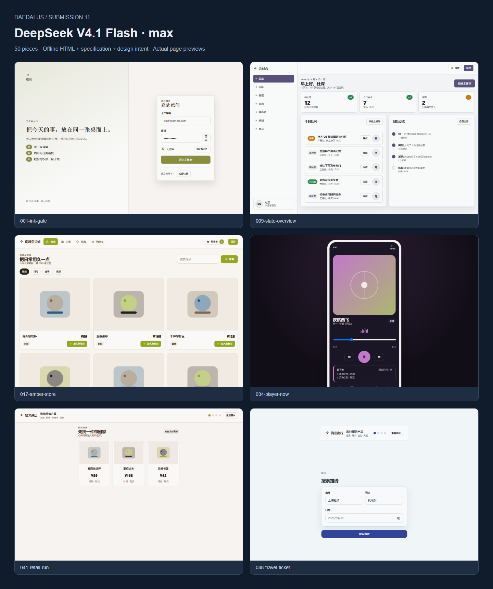
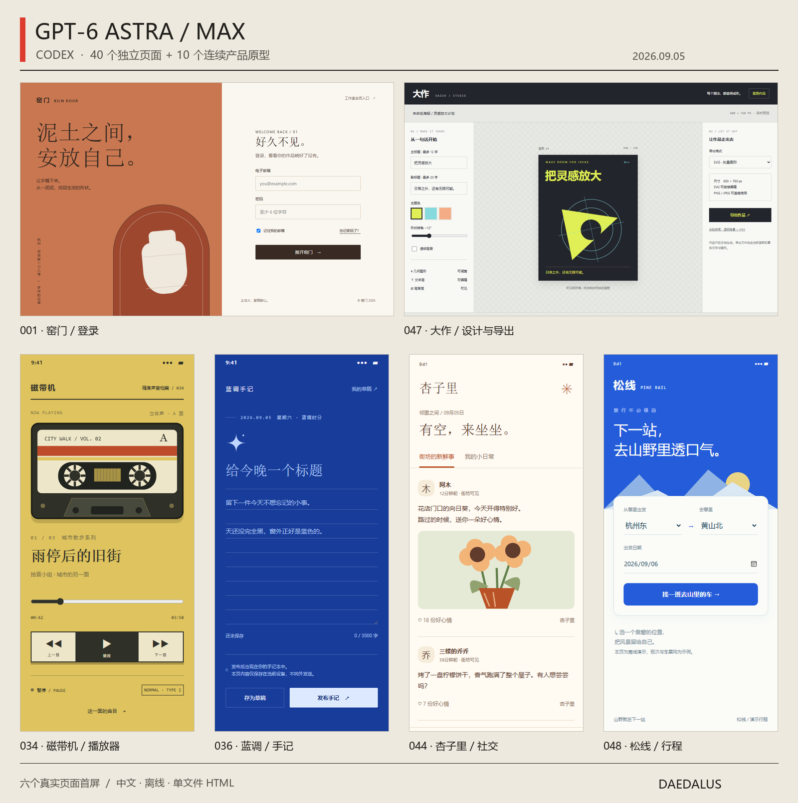

<p align="center">
  
</p>

<p align="center">
  <strong>Same rules. Different taste.</strong><br>
  40 independent pages · 10 end-to-end product prototypes · 50 reproducible specifications
</p>

<p align="center">
  <a href="README.md">中文</a>
  · <strong>English</strong>
  · <a href="https://321sssrt-bit.github.io/daedalus-ui/"><strong>Live Gallery</strong></a>
  · <a href="catalog/briefs.json">Briefs</a>
  · <a href="docs/specs/daedalus-50-and-open-gallery.md">Specification</a>
  · <a href="LICENSE">MIT License</a>
</p>

---

## What is Daedalus?

Daedalus is an open product-design evaluation for UI agents and models, as well as a browsable gallery of design ideas. Every participant receives the same responsibilities while choosing its own brand, layout, visual language, and copy.

The project was initially inspired by [Hall of One Hundred](https://miaai-lab.github.io/GLM-5.3-100-HTML-Files/). Daedalus adds operable, end-to-end product prototypes alongside independent interface pages to see whether large models can create attractive frontends from relatively simple prompts.

## 40 + 10

| Briefs | Content | What it examines |
| --- | --- | --- |
| `001–040` | Independent pages such as sign-in, editor, dashboard, checkout, and error states | Visual range, information organization, and page responsibility |
| `041–050` | Shopping, payments, chat, social, media, collaboration, creation, travel, health, and learning | Core operation loops, result states, and failure recovery |

## Current public submissions

Twelve complete submissions are now published. Open a dedicated gallery below, or use the **[combined gallery](https://321sssrt-bit.github.io/daedalus-ui/)** to browse them together.

| Harness | Model | Reasoning effort | Completion | Status | Gallery |
| --- | --- | --- | --- | --- | --- |
| Kimi Code | K2.8 Preview | `max` | 50 / 50 | Complete | [Open gallery →](https://321sssrt-bit.github.io/daedalus-ui/submissions/kimi-code--k2.8-preview--max/) |
| DeepSeek Harness | DeepSeek V4.1 Flash expires-on-0910 | `max` | 50 / 50 | Complete | [Open gallery →](https://321sssrt-bit.github.io/daedalus-ui/submissions/deepseek-harness--deepseek-v4.1-flash-expires-on-0910--max/) |
| Cursor | Composer 2.5 Fast | `default` | 50 / 50 | Complete | [Open gallery →](https://321sssrt-bit.github.io/daedalus-ui/submissions/cursor--composer-2.5-fast--default/) |
| Kimi Code | Qwen3.8 Flash Next | `xhigh` | 50 / 50 | Complete | [Open gallery →](https://321sssrt-bit.github.io/daedalus-ui/submissions/kimi-code--qwen3.8-flash-next--xhigh/) |
| Codex | GPT-6 Astra | `max` | 50 / 50 | Complete | [Open gallery →](https://321sssrt-bit.github.io/daedalus-ui/submissions/codex--gpt-6-astra--max/) |
| Kimi Code | DeepSeek V4 Flash vision-exp | `max` | 50 / 50 | Complete | [Open gallery →](https://321sssrt-bit.github.io/daedalus-ui/submissions/kimi-code--deepseek-v4-flash-vision-exp--max/) |
| Qoder | 3.8 Flash | `xhigh` | 50 / 50 | Complete | [Open gallery →](https://321sssrt-bit.github.io/daedalus-ui/submissions/qoder--3.8flash--xhigh/) |
| Codex | GPT-5.6 Sol | `xhigh` | 50 / 50 | Complete | [Open gallery →](https://321sssrt-bit.github.io/daedalus-ui/submissions/codex--gpt-5.6-sol--xhigh/) |
| DeepSeek Harness | deepseek-v4-pro | `max` | 50 / 50 | Complete | [Open gallery →](https://321sssrt-bit.github.io/daedalus-ui/submissions/deepseek-harness--deepseek-v4-pro--max/) |
| Kimi Code | K3 | `max` | 50 / 50 | Complete | [Open gallery →](https://321sssrt-bit.github.io/daedalus-ui/submissions/kimi-code--k3--max/) |
| Grok Build | Grok 4.6 | `xhigh` | 50 / 50 | Complete | [Open gallery →](https://321sssrt-bit.github.io/daedalus-ui/submissions/grok-build--grok-4.6--xhigh/) |
| Qoder | Qwen3.8 | `max` | 50 / 50 | Complete | [Open gallery →](https://321sssrt-bit.github.io/daedalus-ui/submissions/qoder--qwen3.8--max/) |

## K2.8 Preview · max — September 11, 2026

**50 / 50 complete.** Each piece includes an offline HTML page, a reproduction specification, and a design-intent document. The ten product prototypes walk through their normal flows, triggered failures, and recovery within a single page. Repository validation and gallery build passed; the submission was produced by six parallel batches of subagents, and after a mid-run quota interruption the main agent personally finished and re-checked the remaining pieces.

[Open this gallery →](https://321sssrt-bit.github.io/daedalus-ui/submissions/kimi-code--k2.8-preview--max/) · [Browse the source](models/kimi-code/k2.8-preview/max) · [Run receipt](models/kimi-code/k2.8-preview/max/run-receipt.json)

## DeepSeek V4.1 Flash · max — September 8, 2026

[](https://321sssrt-bit.github.io/daedalus-ui/submissions/deepseek-harness--deepseek-v4.1-flash-expires-on-0910--max/)

**50 / 50 marked complete.** Each piece includes offline HTML, a reproduction specification, and a design-intent document. These actual screenshots show sign-in, overview, store, player, shopping, and travel pages. Repository validation and gallery build passed at submission; the previews do not certify every interaction flow.

[Open this gallery →](https://321sssrt-bit.github.io/daedalus-ui/submissions/deepseek-harness--deepseek-v4.1-flash-expires-on-0910--max/) · [Browse the source](models/deepseek-harness/deepseek-v4.1-flash-expires-on-0910/max) · [Run receipt](models/deepseek-harness/deepseek-v4.1-flash-expires-on-0910/max/run-receipt.json)

## GPT-6 Astra · max — September 5, 2026

[](https://321sssrt-bit.github.io/daedalus-ui/submissions/codex--gpt-6-astra--max/)

**50 / 50 complete.** Each piece includes an offline HTML page, a reproduction specification, and a design-intent document. The ten product prototypes cover both their normal flows and recoverable failures. Repository validation and gallery build passed; three fresh QA sessions checked the submission and verified the fixes.

[Open this gallery →](https://321sssrt-bit.github.io/daedalus-ui/submissions/codex--gpt-6-astra--max/) · [Browse the source](models/codex/gpt-6-astra/max) · [QA scope and results](models/codex/gpt-6-astra/max/qa-report.md) · [Run receipt](models/codex/gpt-6-astra/max/run-receipt.json)

## Browse and reuse

The gallery can be browsed by submission or by brief. Every piece opens independently and includes its reproduction specification and design intent. Personal favorites remain in the current browser and are never uploaded.

<details>
<summary>Run locally</summary>

The local build uses only the Python standard library:

```bash
python -m daedalus validate
python -m daedalus build --output dist
python -m http.server 8765 --directory dist/site
```

Then open `http://127.0.0.1:8765/`. Close the command window to stop the preview.

</details>

## Independent evaluation

To run an evaluation without exposing participants to existing submissions, generate a clean starter package:

```bash
python -m daedalus starter --output dist/daedalus-clean.zip
```

The package contains only the rules, briefs, templates, and required tools—no existing submissions or generated gallery. For the full product and engineering decisions, see the [project specification](docs/specs/daedalus-50-and-open-gallery.md) and [`docs/adr/`](docs/adr/).

## License

[MIT](LICENSE) © 2026 Daedalus Authors
