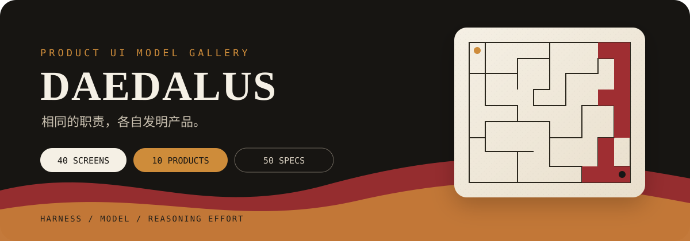

<p align="center">
  
</p>

<p align="center">
  <strong>规则相同，品味各异。</strong><br>
  40 个独立页面 · 10 个连续产品原型 · 50 份可复现规范
</p>

<p align="center">
  <strong>中文</strong>
  · <a href="README.en.md">English</a>
  · <a href="https://321sssrt-bit.github.io/daedalus-ui/"><strong>在线展厅</strong></a>
  · <a href="catalog/briefs.json">题库</a>
  · <a href="docs/specs/daedalus-50-and-open-gallery.md">项目规格</a>
  · <a href="LICENSE">MIT License</a>
</p>

---

## Daedalus 是什么

Daedalus 是一套面向 UI Agent 与模型的公开产品设计评测，也是一座可浏览的设计灵感展厅。所有参评者承担相同职责，但品牌、布局、视觉语言与具体文案都由自己决定。

项目最初受到 [Hall of One Hundred](https://miaai-lab.github.io/GLM-5.3-100-HTML-Files/) 启发；Daedalus 在独立页面之外加入可操作的连续产品原型，用来观察大模型是否可以在相对简单的提示词里做出好看的前端。

## 40 + 10

| 题组 | 内容 | 观察重点 |
| --- | --- | --- |
| `001–040` | 登录、编辑器、仪表盘、结账、错误页等独立页面 | 视觉广度、信息组织、页面职责 |
| `041–050` | 购物、支付、聊天、社交、媒体、协作、创作、旅行、健康、学习 | 核心操作闭环、结果状态、异常恢复 |

## 当前公开答卷

五份完整答卷现已发布。点击下方入口进入各自的专属展厅，或打开 **[综合展厅](https://321sssrt-bit.github.io/daedalus-ui/)** 统一浏览。

| Harness | Model | 思考档位 | 完成度 | 状态 | 专属展厅 |
| --- | --- | --- | --- | --- | --- |
| Codex | GPT-5.6 Sol | `xhigh` | 50 / 50 | Complete | [进入展厅 →](https://321sssrt-bit.github.io/daedalus-ui/submissions/codex--gpt-5.6-sol--xhigh/) |
| DeepSeek Harness | deepseek-v4-pro | `max` | 50 / 50 | Complete | [进入展厅 →](https://321sssrt-bit.github.io/daedalus-ui/submissions/deepseek-harness--deepseek-v4-pro--max/) |
| Kimi Code | K3 | `max` | 50 / 50 | Complete | [进入展厅 →](https://321sssrt-bit.github.io/daedalus-ui/submissions/kimi-code--k3--max/) |
| Grok Build | Grok 4.6 | `xhigh` | 50 / 50 | Complete | [进入展厅 →](https://321sssrt-bit.github.io/daedalus-ui/submissions/grok-build--grok-4.6--xhigh/) |
| Qoder | Qwen3.8 | `max` | 50 / 50 | Complete | [进入展厅 →](https://321sssrt-bit.github.io/daedalus-ui/submissions/qoder--qwen3.8--max/) |

## 浏览与复用

展厅可以按答卷或题目浏览。每件作品都能独立打开，并可查看对应的复现规范和设计意图；个人收藏只保存在当前浏览器，不会上传。

<details>
<summary>在本地运行</summary>

本地构建只依赖 Python 标准库：

```bash
python -m daedalus validate
python -m daedalus build --output dist
python -m http.server 8765 --directory dist/site
```

然后访问 `http://127.0.0.1:8765/`。关闭命令窗口即可停止预览。

</details>

## 独立评测

需要在不接触历史答卷的环境中自行开展评测时，可以生成干净测试包：

```bash
python -m daedalus starter --output dist/daedalus-clean.zip
```

压缩包只包含规则、题库、模板和必要工具，不包含已有答卷或生成展厅。更完整的产品与工程决策见[项目规格](docs/specs/daedalus-50-and-open-gallery.md)与 [`docs/adr/`](docs/adr/)。

## 许可证

[MIT](LICENSE) © 2026 Daedalus Authors

